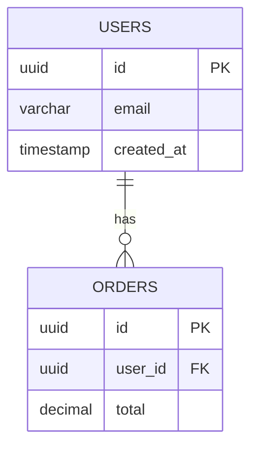

## Project Goal

Enhance **EventCatalog** to support **relational database documentation** in the same way it documents **event-driven architectures** — providing a clear, versioned, and visual catalog of database structures.

This will allow development teams to:

* Understand database design at a glance.
* Document tables, views, stored procedures, functions, and schemas.
* Visualize relationships between entities.
* Detect inconsistencies in the database model.
* Collaborate better across teams.
* Keep schema documentation versioned and always up to date.

---

## 1. **Database Entity Catalog**

Introduce a new section: `/database`

Supported entities:

* **Tables**
* **Views**
* **Stored Procedures**
* **Functions**
* **Schemas**

Each entity would be represented as a JSON or YAML file, e.g.:

```json
// /database/tables/users.json
{
  "name": "users",
  "description": "Stores user account data including login credentials and personal info.",
  "owner": "team-auth",
  "tags": ["core", "authentication"],
  "lastReviewed": "2025-05-10",
  "columns": [
    { "name": "id", "type": "uuid", "primaryKey": true },
    { "name": "email", "type": "varchar", "nullable": false },
    { "name": "created_at", "type": "timestamp" }
  ],
  "relationships": [
    { "type": "one-to-many", "target": "orders", "sourceColumn": "id", "targetColumn": "user_id" }
  ]
}
```

---

## 2. **Version Control and Schema Diff**

* Each database entity is stored in version-controlled files.
* Changes can be reviewed using diffs (just like for events).
* Useful for:

  * Auditing schema changes.
  * Detecting breaking changes.
  * Keeping history of how the database evolved.

---

## 3. **Entity Relationship Diagram (ERD)**

Use [**Mermaid**](https://mermaid.js.org/) to visualize tables and relationships directly in EventCatalog UI.

### Example (Mermaid Syntax):



### Benefits:

* See the big picture of how entities are connected.
* Spot missing relationships or bad modeling.
* Align data design with event modeling (services/events can reference tables).

---

## 4. **Search and Cross-Linking**

* Full-text search for any table, column, or procedure.
* Auto-link between related entities:

  * View → referenced tables.
  * Table → procedures using it.
* Impact analysis (e.g., “which views use this column?”).

---

## 5. **Custom Metadata Support**

Support rich metadata for each entity.

### Examples:

```json
{
  "description": "Handles all user-related data.",
  "tags": ["authentication", "core", "critical"],
  "owner": "team-auth",
  "lastReviewed": "2025-05-10",
  "status": "active",
  "sourceSystem": "postgres"
}
```

This will be rendered in the UI with badges, labels, and detail panels.

---

## 6. **Import and Sync Support**

Optional CLI or scripts to generate entity files from:

* Live databases (PostgreSQL, MySQL, SQL Server, etc.).
* SQL DDL files.
* DBML (`.dbml`) or Prisma schema files.

This ensures fast adoption and easier onboarding for existing databases.

---

## 7. **UI Integration (Example Navigation)**

Add a new section in the sidebar:

```
📁 /database
   📄 tables
      - users
      - orders
   📄 views
      - active_users
   📄 procedures
      - create_user
```

Each page includes:

* Description and metadata
* Mermaid diagram (if applicable)
* Column/procedure/function detail tables
* Linked references (to views, services, or events)

---

## Benefits for Teams

* **Improved communication** across dev, ops, and data teams.
* **Documentation as code**: easy to version, review, and share.
* **Unified catalog**: APIs, events, and databases in one place.
* **Faster onboarding** and smoother change management.
